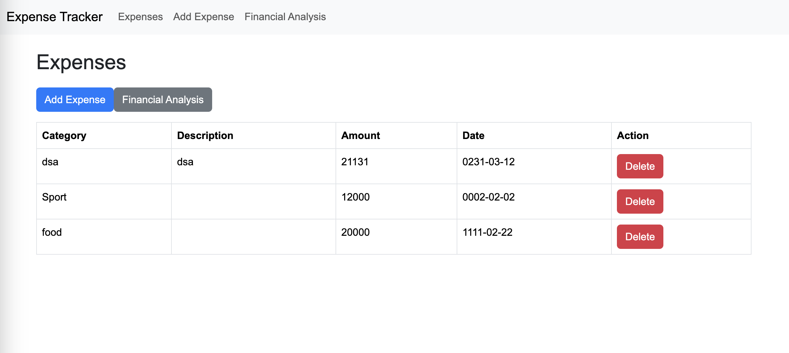
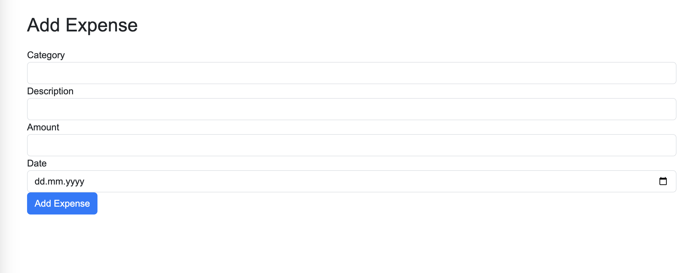
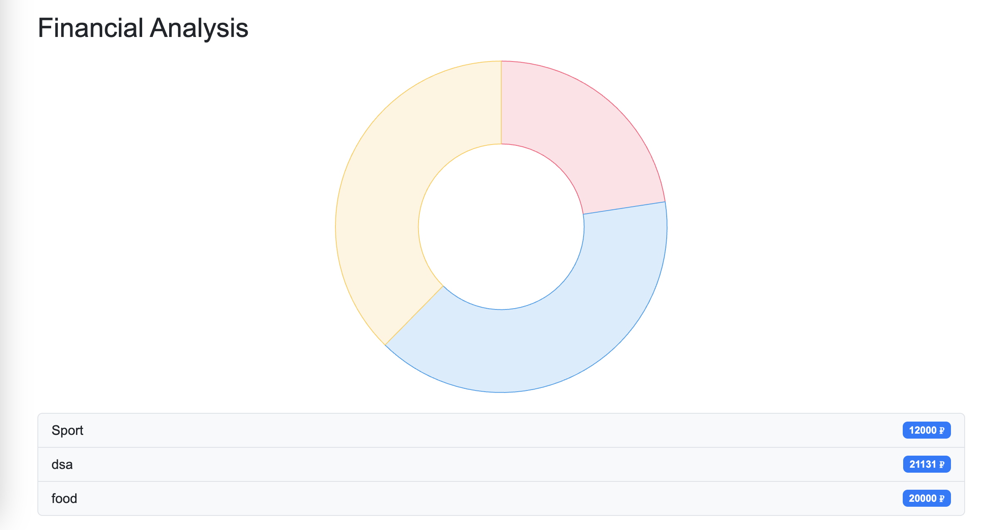

Yes, i did it in 1 hour.

# INSTALL:

### !!! May need to install python + venv + npm + flask_cors

cd backend
python3 -m venv venv

## FOR MAC
source venv/bin/activate
## FOR WINDOWS
venv\Scripts\activate

## NEXT:
pip install -r requirements.txt \
python3 app.py

!!! Open new terminal 

cd ../frontend \
npm install --legacy-peer-deps \
npm start

# UNINSTALL

cd ../ \
./uninstall.bash

## OR 

rm -rf backend/venv \
rm -rf frontend/node_modules frontend/package-lock.json

